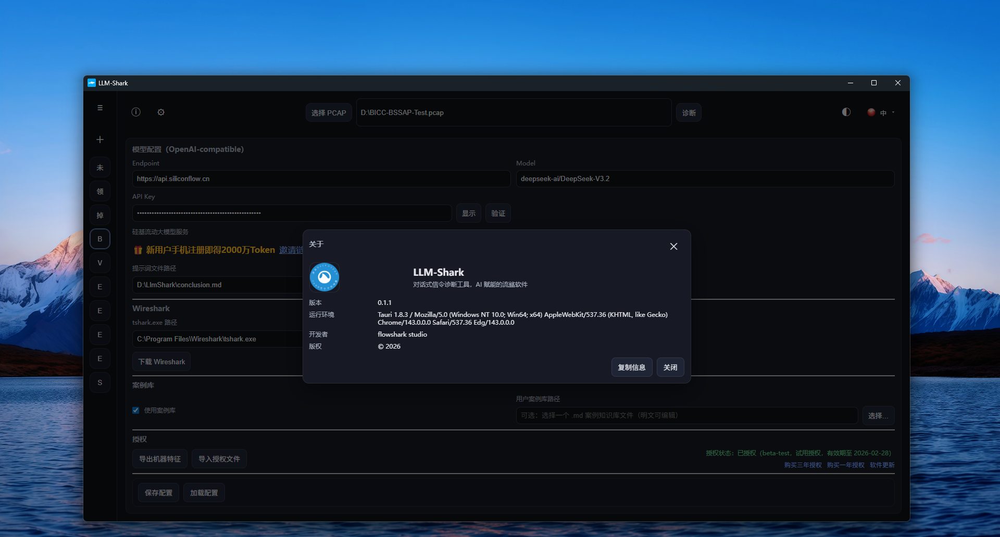
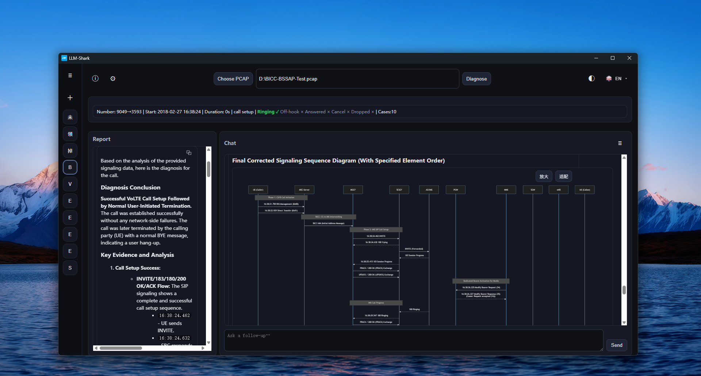
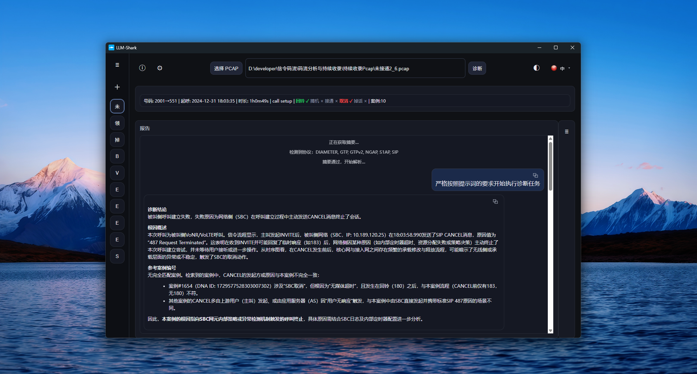
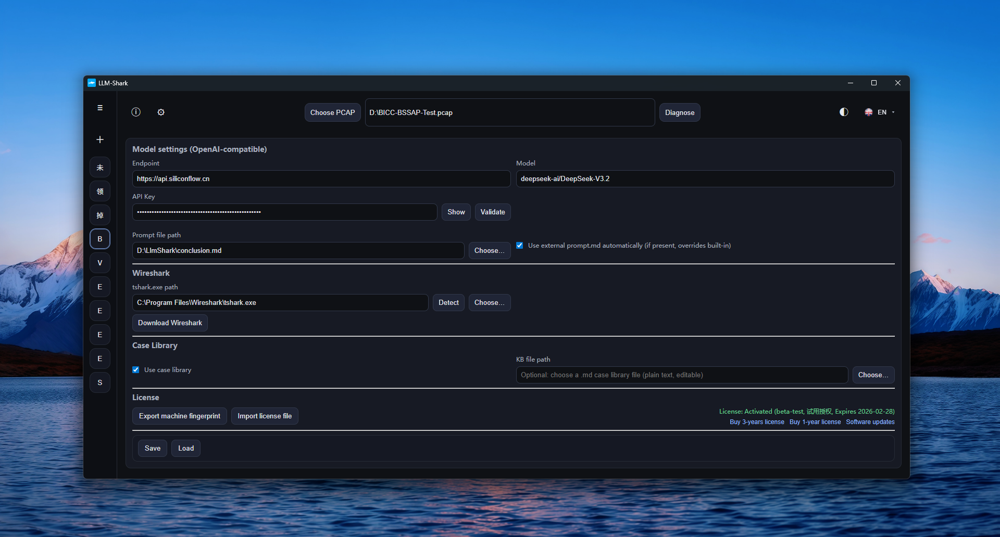

# LLM-Shark v0.1.1

LLM-Shark 是一款面向通信/网络工程师的桌面端“对话式信令诊断工具”。它把 PCAP 中的关键信令抽取、时序图呈现、案例知识库检索与大模型分析串成一条可复用的诊断链路，让定位问题更快、更可解释、可沉淀。

## 适用场景

- VoLTE/IMS 呼叫建立失败、异常释放、单通、无声、注册失败等排障
- LTE/5G 核心网/接入网信令问题定位（常见协议栈如 S1AP/NGAP、GTPv2、DIAMETER 等）

## 核心功能与特色

- 一键诊断：选择 PCAP 后自动生成摘要，判断是否建议继续深入分析
- 全量解析与结构化报告：输出 report.json、analysis.json、信令表（JSON/CSV）等可追溯结果
- 时序图可视化：自动生成 Mermaid 时序图，支持缩放/适配，便于沟通与复盘
- 案例知识库增强：内置加密案例库（1700+ 条真实案例），按信令特征检索命中，给出可对照的“相似案例/诊断结论/根因”
- 对话式追问：在同一份“结构化报告 + 命中案例 + 时序图”上下文中追问，输出更稳定、更贴近现场的结论与下一步建议
- OpenAI 兼容模型接入：支持配置 OpenAI-compatible Endpoint/Model，可对接云端或本地模型服务
- 多语言界面：内置多语言 UI（含中文/英文等十国语言包）

## 典型工作流

1. 选择 PCAP → 点击“诊断”
2. 自动生成摘要（用于快速判断与定向）
3. 生成解析报告与时序图，并展示关键信令表
4.（可选）启用案例知识库检索，获得相似案例与根因对照
5.（可选）在“对话”中继续追问：结论、证据帧号、排查路径与建议动作

## Prompt 自定义

- 用户可以自行编辑修改提示词来调整或重塑 LMM 的思考与行为，在设置界面指定使用的 prompt 文档
- 目录内提供了一份 conclusion.md 要求 LMM 提供简洁答复

## 交付与运行要求（面向客户）

- 程序形态：Windows 桌面端应用（MSI 安装包或解压即用的目录）
- WebView2：运行需要 Microsoft Edge WebView2 Runtime（Windows 10/11 多数已内置；若缺失需安装）
- tshark：PCAP 解析依赖 tshark.exe（来自 Wireshark/Portable Wireshark），在设置中配置路径即可
- 模型调用：如使用 LLM 诊断/追问，需要可访问的模型 Endpoint 及相应凭据（可留空用于本地模型）

## 授权与合规交付

- 授权文件放置在启动路径，并进入软件的设置界面导入授权
- 测试版提供了45天免费试用授权，限制每天可诊断3个PCAP文件

## 已知问题

- 大模型在回复时，其内容具有一定的随机性，其诊断结论仅供参考，还不能稳定地作为专业诊断结论使用
- 为了对抗随机性，建议在使用时对同一个PCAP执行2-3次诊断，对结果进行评估和选用