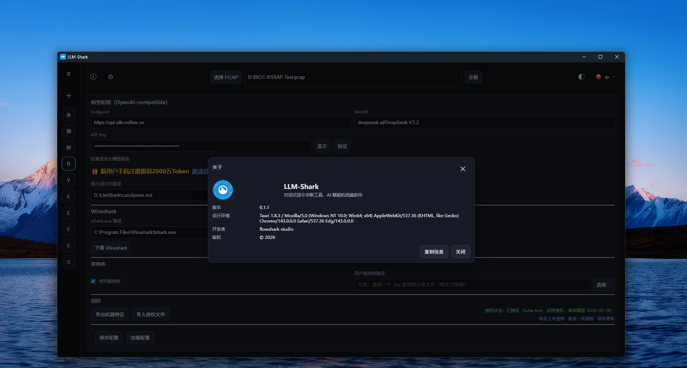
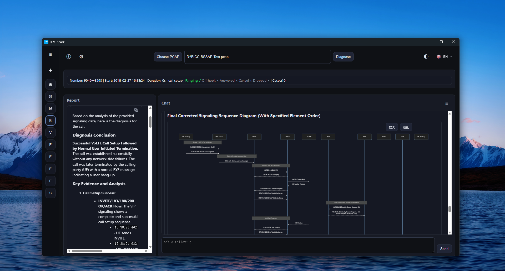
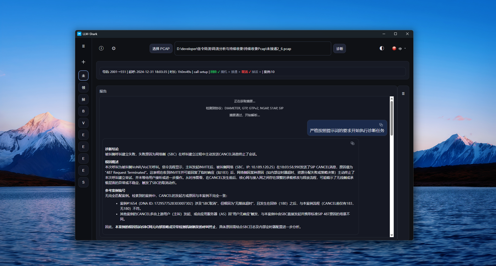
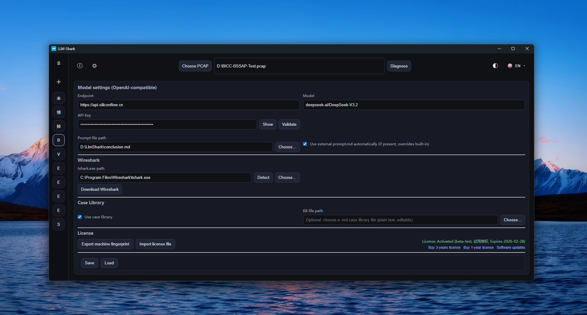

# LLM-Shark v1.0.x

[中文](./readme.md) | **English**

LLM-Shark is a desktop **conversational signaling diagnostic tool** designed for telecom / network engineers. It chains PCAP signaling extraction, sequence diagram rendering, case knowledge base retrieval, and LLM analysis into a reusable diagnostic pipeline — making problem isolation faster, more explainable, and knowledge-preserving.

LLM-Shark supports 22 languages (for both UI and LLM conversations) and is available on the Microsoft Store. Download the latest version here:

Web-Link:	https://apps.microsoft.com/detail/9NJQ6N01CF65

MS-Store: 	ms-windows-store://pdp/?productid=9NJQ6N01CF65

This repository does not include source code. It primarily provides binary downloads for early releases (see Assets) and occasional new-version packages.



## Use Cases

- VoLTE/IMS call setup failures, abnormal releases, one-way audio, no audio, registration failures, and related troubleshooting
- LTE/5G core network / RAN signaling issue diagnosis (common protocol stacks: S1AP/NGAP, GTPv2, DIAMETER, etc.)

## Core Features

- **One-click diagnosis** — Select a PCAP and automatically generate a summary to decide whether deeper analysis is warranted
- **Full parsing & structured reports** — Outputs `report.json`, `analysis.json`, signaling tables (JSON/CSV), and other traceable artifacts
- **Sequence diagram visualization** — Auto-generates Mermaid sequence diagrams with zoom/fit support, ideal for reviews and handoffs
- **Case knowledge base augmentation** — Built-in encrypted case library (1,700+ real-world cases); retrieves similar cases by signaling pattern and surfaces comparable diagnoses, conclusions, and root causes
- **Conversational follow-up** — Continue asking questions within the same context of structured report + matched cases + sequence diagram for more stable, field-accurate conclusions and next-step recommendations
- **OpenAI-compatible model integration** — Configure any OpenAI-compatible Endpoint/Model to connect cloud or local model services
- **Multi-language UI** — Built-in localization supporting Chinese, English, and 20+ other languages



## Typical Workflow

1. Select a PCAP → click **Diagnose**
2. Automatically generate a summary (for quick triage and direction)
3. Generate a parsed report and sequence diagram; display the key signaling table
4. *(Optional)* Enable case knowledge base retrieval for similar cases and root-cause comparison
5. *(Optional)* Continue in **Chat** to ask follow-up questions about conclusions, evidence frame numbers, investigation paths, and recommended actions

## Prompt Customization

- Users can edit prompts directly to adjust or reshape the LLM's reasoning and behavior. Specify the prompt document in the settings screen.
- A sample `conclusion.md` is included in the directory to instruct the LLM to provide concise answers.



## Delivery & Runtime Requirements

- **Application type:** Windows desktop application (MSI installer or portable directory)
- **WebView2:** Requires Microsoft Edge WebView2 Runtime (pre-installed on most Windows 10/11 systems; install manually if missing)
- **tshark:** PCAP parsing depends on `tshark.exe` (from Wireshark or Portable Wireshark); configure the path in settings
- **Model endpoint:** If using LLM diagnosis or follow-up chat, a reachable model Endpoint and credentials are required (can be left blank for local models)

## ## License

- The software is available on the Microsoft Store and can be subscribed to via the Store's built-in payment system.
- Free tier: up to 3 PCAP files per day, with each file capped at 1 MB (sufficient for the vast majority of use cases).
- Subscription tier: unlimited PCAP files, with the per-file size limit raised to 5 MB (in practice, you're unlikely to need that much).



## Known Limitations

- LLM responses have inherent variability; diagnostic conclusions should be treated as reference only and are not yet suitable as authoritative professional diagnoses
- To mitigate variability, it is recommended to run 2–3 diagnoses on the same PCAP and evaluate / select among the results


## About LLM-Shark Mobile

How do you diagnose a failed call when there's no PCAP file available?

Even without real signaling data to work from, analysis is still possible based on certain characteristics. This is especially true when call detail records (xDR) are accessible, providing partial call information.

For this use case, we aggregated the characteristics from 1,700 real-world cases into a case knowledge base. When a tester provides call information or characteristics, the system matches them against cases with reasonable similarity and passes the best matches to an LLM for diagnostic reasoning. The resulting preliminary conclusion carries high credibility when a highly-matching case is found, and still holds considerable reference value even when no strong match exists.

LLM-Shark Mobile currently only has an Android version available. Download the APK from the Release section on the right and install it manually:

```bash
adb install 'APK file path'
```